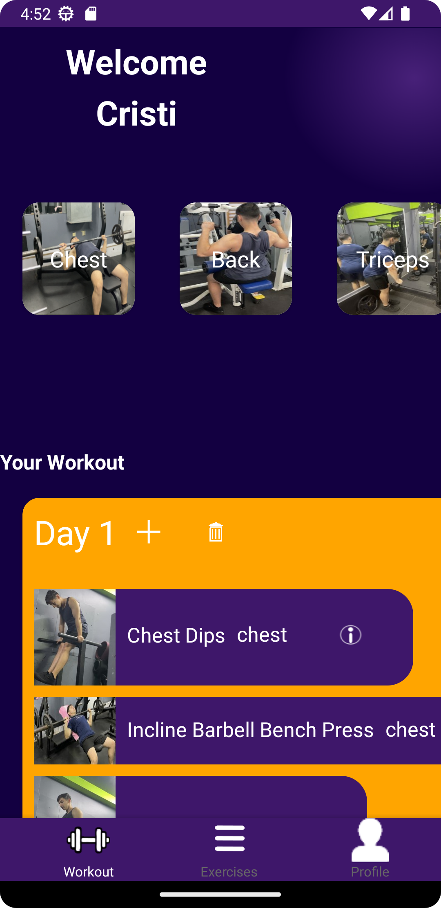
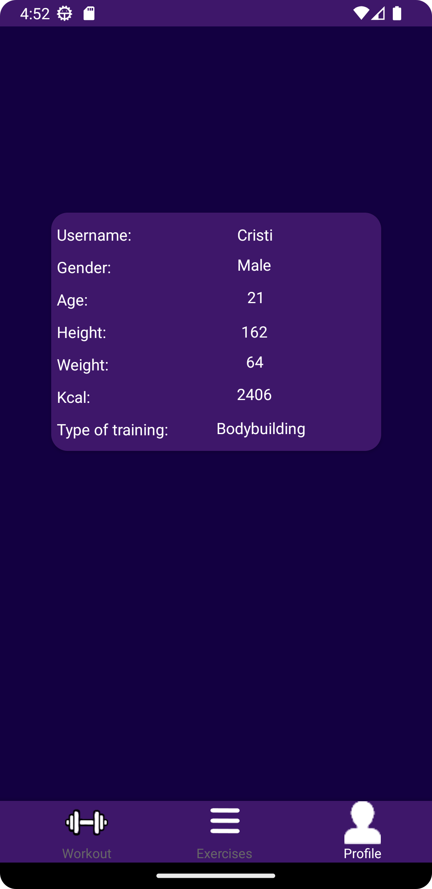
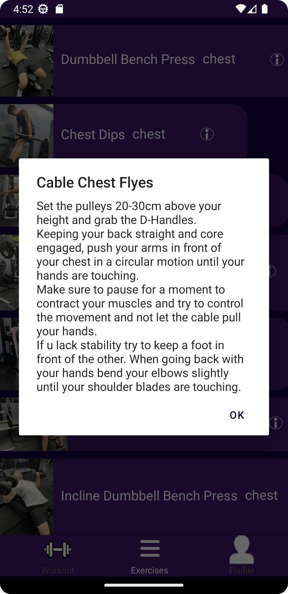
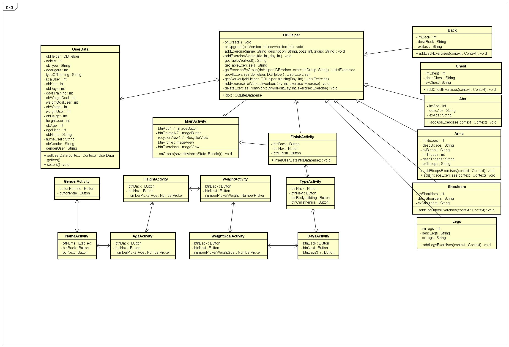

# Virtual-personal-trainer-Antrenor-personal-virtual-

Am dezvoltat aplicația "Antrenor personal virtual", pentru a promova un stil de viață sănătos și activ prin intermediul exercițiilor fizice. Scopul principal al aplicației este de a atrage și motiva utilizatorii să facă sport și să își atingă obiectivele de fitness.
Lucrarea se axează pe procesul de dezvoltare al aplicației, prezentând detaliat tehnologiile utilizate, cum ar fi Android, Android Studio, SQLite. Aceste tehnologii au fost selectate pentru a crea o interfață prietenoasă și ușor de utilizat, adaptată la diferite dimensiuni de ecran și rezoluții.
Aplicația oferă utilizatorilor posibilitatea de a completa un set de întrebări prin care sunt colectate informații despre nevoile și obiectivele lor personale. Pe baza acestor răspunsuri, aplicația generează un plan de antrenament personalizat, care cuprinde exerciții optimizate pentru dezvoltarea mușchilor într-un timp cât mai scurt. Utilizatorii au și opțiunea de a modifica și personaliza antrenamentul prin adăugarea sau ștergerea exercițiilor.

## Obiectivele aplicației
Aplicația își propune să ofere utilizatorilor un antrenament adaptat nevoilor și obiectivelor lor individuale. Prin intermediul unui set de întrebări și informații colectate despre utilizator, aplicația generează un plan de antrenament care să ajute la dezvoltarea mușchilor într-un timp cât mai scurt și eficient. Oferă utilizatorilor posibilitatea de a-și personaliza propriul antrenament prin adăugarea sau ștergerea exercițiilor. Aceasta permite adaptarea antrenamentului în funcție de preferințe, nivelul de fitness și obiectivele individuale ale utilizatorului.
Un alt obiectiv al aplicației este de a oferi o experiență intuitivă și plăcută utilizatorilor. 

## Interfața aplicației

### Pagina cu antrenamente

### Pagina de profil

### Informații exercițiu

## Diagrama UML

##Diagrama UseCase

